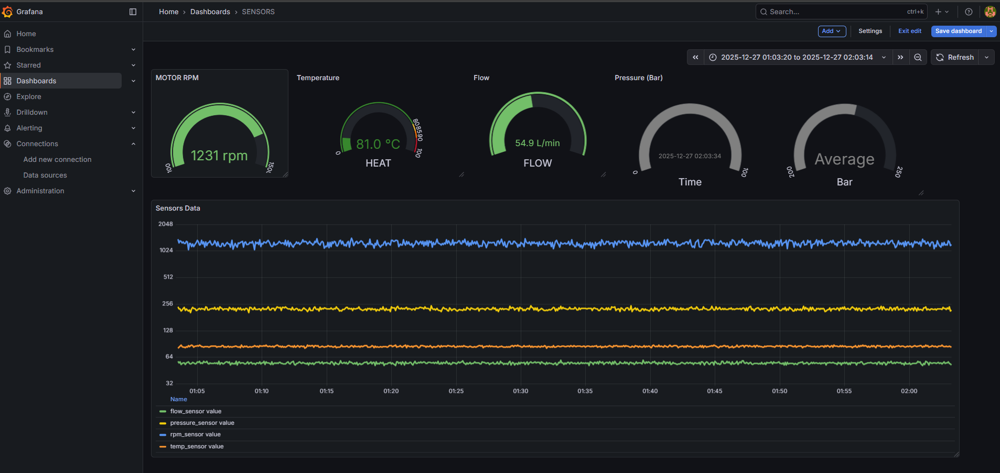

# IIoT Telemetry Stack: Local Docker Environment 🏭

A containerized Industrial IoT (IIoT) pipeline for simulating, capturing, and visualizing real-time sensor data. This project demonstrates an end-to-end telemetry solution—from Edge logic to HMI visualization—orchestrated entirely within a private Docker network.



## 🛠 Tech Stack
* **Orchestration:** Docker Compose (Private Bridge Network)
* **Edge Logic (ETL):** Node-RED (Data normalization & Alerting logic)
* **Time-Series Database:** InfluxDB 2.0 (Flux Query Language)
* **HMI / Visualization:** Grafana (Real-time Gauges, Stats, and Historical Trends)

## 🧠 Project Architecture
**[ Simulated Sensors ]** --->  **[ Node-RED (Edge Gateway) ]** --->  **[ InfluxDB (Storage) ]** --->  **[ Grafana (Dashboard) ]**

## ⚙️ Key Features
* **Multi-Sensor Simulation:** Generates synthetic telemetry for:
    * **Flow Rate** (50-60 L/min)
    * **Temperature** (80-90 °C)
    * **Hydraulic Pressure** (200-250 Bar)
    * **Motor Speed** (1000-1500 RPM)
* **Edge Intelligence:** Node-RED flows process raw inputs and tag data before storage.
* **Alerting Logic:** Automated monitoring detects high-pressure events (> 240 Bar) and flags them in the system.
* **Dual-Axis Visualization:** Grafana dashboard correlates high-speed RPM data against lower-magnitude pressure/flow readings using multi-axis graphing.

## 🚀 How to Run
1.  **Clone the repository:**
    ```bash
    git clone [https://github.com/Abdullah-TAY/IIoT-Telemetry-Stack.git](https://github.com/Abdullah-TAY/IIoT-Telemetry-Stack.git)
    ```
2.  **Configure Security:**
    Create a `.env` file in the root directory and add your InfluxDB admin token.
3.  **Start the Stack:**
    ```bash
    docker-compose up -d
    ```
4.  **Load the Logic:**
    * Open Node-RED at `http://localhost:1880`.
    * Import the provided `flows.json` file.
5.  **View the Dashboard:**
    * Open Grafana at `http://localhost:3000`.
    * Configure the InfluxDB data source and import the panel configurations.

---
*Created as a portfolio project to demonstrate Full Stack IIoT architecture and containerized sensor data pipelines.*
